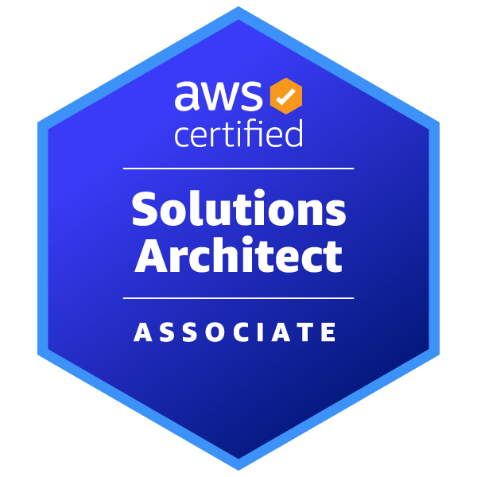

## 基本情報

|key|value|
|---|---|
|氏名|ニッケル|
|居住地|関西圏|

---

## 各種アカウント

---

## 技術スタック

### 言語

  
  
  
  
  
  
  
  

### フレームワーク

  
  
  

### AWS

  
  
  
  
  
  
  
  
  
  

### OS

  
  

### SaaS

### その他技術

---

## スキル

### クラウド

#### AWS

|Date|Qualification|
|---|---|
|2024/02/03|AWS認定 ソリューションアーキテクト アソシエイト(SAA-C03)|
|2024/05/19|AWS認定 ソリューションアーキテクト プロフェッショナル(SAP-C02)|

<table style="border-collapse:collapse; max-width:400px;">
<tr><td></td>
<td></td></tr>
</table>

### その他

|Date|Qualification|
|---|---|
|2023/12/24|基本情報処理技術者試験合格|
|2024/01/05|Oracle Certified Java Programmer, Gold SE11|
|2024/01/20|Oracle Master Silver SQL|

---

## 職務経歴詳細

### 受託開発SIer（2023/05〜現在）
※2023/05~2023/07まで新人研修

#### 製造業向け製版システムの新規開発・運用（2023年8月〜2024年11月）

##### プロジェクト概要
大手製造業企業向けの業務システム開発プロジェクトに参画。  
ウォーターフォール型で進行される中、詳細設計〜開発・テスト・不具合対応まで一連の工程を担当。

##### チーム構成
PM/SE 3名、SE 4名（うち1名がPL）で構成された6〜7名の開発チーム。

##### 担当業務
- Java（JDK17）を用いた帳票出力機能の新規開発（PDF発注書）
  - Service層／Repository層の実装、画面連携、SQL処理の開発
  - XMLベースのSQL定義を使用し、データ取得処理と帳票出力処理を実装
- 既存ソースコードの調査・流用を行いながら、レイアウト設計と仕様整備を実施
- Redmineを用いた課題管理に基づくバグ修正、および単体〜結合テスト対応

##### 使用技術・ツール
- **言語・DB等**：Java (JDK17), JavaScript, MySQL 8, XML
- **ツール類**：A5:SQL Mk-2, TortoiseSVN, WinMerge, LibreOffice, STS4, Redmine, Everything

##### 補足
- 本案件を通じて、業務系画面設計およびPDF帳票開発に関する設計力・調査力を養った。

#### 製造業向けSaaS保守・改善業務（2024年9月〜現在）

##### プロジェクト概要
製造業企業向けの書類管理アプリ（作業手順書／図面などを扱うSaaS）の保守・機能改修を担当。  
小規模なチームで、実務を通じてアプリケーション・インフラ双方に関わる技術・知識を習得中。

##### チーム体制
エンジニア2〜4名（時期により変動）

##### 担当業務
- フロントエンド／バックエンドの改修（Vue.js / Nest.js / TypeScript）
- Nest.jsの脆弱性対応（v10 → v11）に伴う依存パッケージの更新、および破壊的変更点への対応（DI構成、Decoratorなど）
- CI/CDパイプライン（CodeBuild / CodeDeploy / CodePipeline）の保守・改修
  - buildspec.yamlの修正、Dockerビルド最適化、Node.jsの依存関係管理
- AWS環境での運用・保守対応
  - S3によるログ管理、静的コンテンツ管理
  - CloudWatch Logsを用いたFargate上のDockerログ監視
  - Amazon Inspectorによるセキュリティチェックおよび修正対応
  - ECRのイメージ管理、CodePipeline連携による自動デプロイの運用
  - 障害時のDB復旧対応（RDS + CloudFront + EventBridge）

- その他業務
  - 顧客データの復元・物理削除対応（S3 / PostgreSQL）
  - Auth0を利用した認証処理に関するパフォーマンス改善対応
  - フロントエンドのUI修正（CSS / Vue.js）

##### 使用技術・ツール
- **言語・FW**：TypeScript, Vue.js, Node.js, Nest.js, PostgreSQL
- **CI/CD・インフラ**：AWS（S3, ECR, Fargate, RDS, Code系列, CloudFront, EventBridge, Inspector）
- **その他**：Docker, Git, VSCode, Redmine, Backlog, A5:SQL Mk-2, WinMerge, Everything

##### 補足
- 本プロジェクトを通じて、クラウド環境（AWS）上でのアプリケーション運用と、CI/CDパイプラインの構築・改善について、実践的な知識と対応力を習得した。
- CodeBuildやCodePipelineを用いたビルド自動化や、Docker環境での依存解決のプロセスに携わったことで、Node.js系プロジェクトにおけるCI/CD設計・運用の流れを体系的に理解できるようになった。

 
#### 製造業企業のバッチサーバー保守・運用業務（2024年12月〜現在）

##### プロジェクト概要
社内業務自動化のために構築されたWindowsバッチサーバーの保守・運用を担当。  
実行エラーの調査対応やスケジュール設定の見直しを通じて、システムの安定稼働に貢献。

##### チーム体制
運用チーム2名体制（自分含む）

##### 担当業務
- Windowsバッチファイルの改修・保守（CMDスクリプト）
  - ロジックの見直し、不要処理の削除、エラー発生箇所の修正
- バッチ処理で発生したエラーのログ調査・原因特定・復旧対応
- タスクスケジューラを用いた実行タイミングの最適化
  - 他処理との依存関係を確認し、衝突・遅延の改善を実施
- Windows Virtual Desktop (WVD) 環境での作業検証

##### 使用技術・ツール
- **スクリプト**：Windowsバッチファイル（.bat）
- **ツール**：タスクスケジューラ、Windows Virtual Desktop (WVD)

##### 補足
- 実行環境やタイミングによる“気まぐれ系”エラーの対処を通じて、バッチの安定性とメンテナンス性を改善した。

 
#### 製造業企業の社内システム保守（2025年4月〜現在）

##### プロジェクト概要
製造業企業が利用する社内業務システムの保守・改修を担当。  
コード修正だけでなく、実行環境の検証やデータベース操作、テンプレートの調査など幅広い業務に対応。

##### チーム体制
保守担当エンジニア2名（自分含む）

##### 担当業務
- 社内RPA処理における不具合調査・コード修正（PHP）
- メール送信処理のテンプレート文言／出力内容の見直し対応
- PostgreSQLに関するデータ抽出・依頼対応（psql / phpPgAdmin）
- Smartyテンプレート内でのロジック調査と仕様確認（ビュー層の調査）
- Ubuntu 24.04（WSL2上）での動作検証・Composer依存調整

##### 使用技術・環境
- **言語・FW**：PHP 8.3, Smarty, PostgreSQL
- **OS・環境**：Ubuntu 24.04（WSL2）
- **ツール**：VSCode, Tera Term, phpPgAdmin, Apache2, phpSpreadsheet, composer, WinSCP

##### 補足
- 開発・実行環境の構築にUbuntu（WSL2）を活用。依存関係の解決や検証タスクを通じて、Linux環境に対する理解を深めた。
- 単なるコード修正にとどまらず、テンプレート・DB・実行環境の全方位を対象とした「軽インフラ寄り」な保守を実施中。

